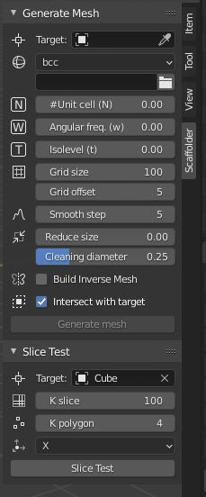

# Blender plugin

After the PyScaffolder addon for Blender is [installed and enabled](installation.md#blender-addon), press <kbd class="key-n">N</kbd> or View > Sidebar to show a sidebar tab in right-hand side.
Then Scaffolder will be found in one tab of a that sidebar, as shown in the following figure.

See [Command line](cmd.md) for the description of the parameters used in mesh generation.

## Video

<iframe width="560" height="315" src="https://www.youtube-nocookie.com/embed/ikIiC3XrBeM" title="YouTube video player" frameborder="0" allow="accelerometer; autoplay; clipboard-write; encrypted-media; gyroscope; picture-in-picture" allowfullscreen></iframe>