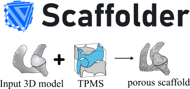

# Scaffolder


<div style="text-align:center">

</div>

The [triply periodic minimal surface (TPMS)]() topology is beautiful.
They constructed from a [mathematical implicit function](http://matkcy.github.io/MA1104-implicitplot.html) $f(x,y,z)=0$ and resulted in 3D mesh by [Marching cubes](https://en.wikipedia.org/wiki/Marching_cubes). However, the creating process of a TPMS mesh from a complex shape like human bone is quite complicated.
"Scaffolder" offers the easy solution via commandline, Python API, and Blender plugins.

## Applications
- Volumetric CAD
- Surface visualization
- Multi-morphology porous scaffold design
- Porous bone implant design
- Finite element analysis (FEA)

## How it works
- Read STL file and finding the boundary box
- Generate the grid and calculate the winding number with STL mesh
- Generate the 3D isosurface field
- Perform [Dual marching cube](https://github.com/dominikwodniok/dualmc) to construct the 3D mesh
- Clean up the duplicated vertices or faces, and abandon the group of connected faces having the diameter below the setting
- Export to the target 3D format

## Citation
[Computational method and program for generating a porous scaffold based on implicit surfaces](https://doi.org/10.1016/j.cmpb.2021.106088)
```bibtex
@article{IAMSAMANG2021106088,
title = {Computational method and program for generating a porous scaffold based on implicit surfaces},
journal = {Computer Methods and Programs in Biomedicine},
volume = {205},
pages = {106088},
year = {2021},
issn = {0169-2607},
doi = {https://doi.org/10.1016/j.cmpb.2021.106088},
url = {https://www.sciencedirect.com/science/article/pii/S0169260721001632},
author = {Jirawat Iamsamang and Phornphop Naiyanetr},
keywords = {Triply periodic minimal surface (TPMS), Implicit surface, Porous scaffold, Pore size, Porosity}
}
```

--8<-- "docs/includes/abbreviations.md"