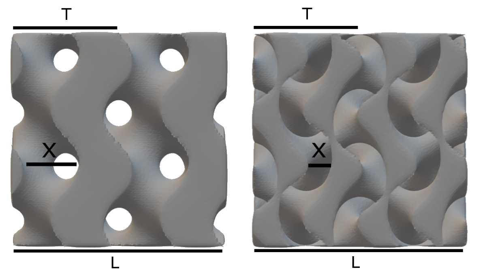
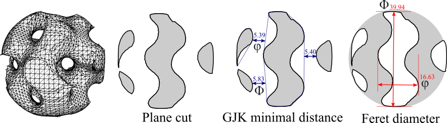

--8<-- "docs/includes/abbreviations.md"

# Tips

## What is the value of $w$ used for pore size $x$?

The angular frequency ($w$) control the number of repetitive TPMS units:

$$
w = 2\pi / T = 2\pi N / L
$$

where $T$ = period or length of a unit cell, $N$ = the number of unit cells, and $L$ = the length of input 3D mesh.

For example, if we want $N=2$ in `cube20mm.stl` ($L=20mm$), $w$ will be $2\pi*2/20 = \pi/5$
(the unit of $L$ has the same dimension with the input mesh).



The image show the Gyroid (left) and Double-Gyroid (right) with $w=\pi/5$ and $t=0$. The pore size $x \approx T/2$
for Gyroid and $T/4$ for Double-Gyroid. Then,

$$
w \approx \left\{
\begin{array}{l}
\pi/x, & \text{for gyroid} \\ 
\pi/2x, & \text{for double-gyroid}
\end{array}
\right.
$$

If we want a gyroid with $x=5mm$, we will set $w=\pi/5$.

### Example:
```
./Scaffolder cube20mm.stl out.ply -c 3.14159 -g 100 -n tubulat_g_ab
```
Program will generate the scaffold from `cube20mm.stl` ($L=20mm$) with theoretical $N=10$

## How to reduce the size of 3D mesh?
Scaffolder uses the Quadratic decimation from [MeshLab][] to reduce the result 3D mesh with an option `--size_optimize` (`-z`).
For example, the following command is used to generate a gyroid with 50% decimation, thus resulting the 50% less faces:
```
./Scaffolder input.stl out.stl gyroid,0.6283,0.61,200 -z 0.5
```

!!! note
    You can manually reduce the size by using [MeshLab][]: Filter > Remeshing, Simplification, and Reconstruction > Simplification: Quadric Edge Collapse Decimation

## How to intrepret the output from console?

Suppose that the following command was used: 
```
.\Scaffolder.exe .\cube20mm.stl out.stl gyroid,0.6283,0.61,100
```

Then this is an output generated by program with default options (`--format default`) 
```linenums="1" hl_lines="1 26 28 31 30 35 37 46"
[Scaffolder v1.5.1]
-- Input file: .\cube20mm.stl
-- Output file: out.stl
-- Surface (-n): gyroid
-- Coff (-c): 0.6283
-- Isolevel (-t): 0.61
-- Grid size (-g): 100
--   Grid offset: 3
--   Shell: 0
-- Autoclean: True
--   Minimum diameter: 25%
--   Smooth step: 5
--   Fix self-intersect: False
--   Quadric Simplification (-z): 0
-- Analysis microstructure (-m): False
--   Slice grid (k_slice): 100
--   Nearest outer contours (k_polygon): 4
--   Export microstructure: False
--   Mean curvature: False
-- Export JPEG: No
--   Axis: X
-- Build: Yes(Intersect)
-- Bounding Box: [0, 0, 0] [20, 20, 20]
-- Length: [20, 20, 20]
-- Grid delta: 0.2
[Generating grid] OK
-- Grid size: 1191016 [106, 106, 106]
[Calculating Winding number] OK
-- Sign Distance: [ -1.03923, 9.99999]  Wind: [ -2.86488e-06, 1]
[Generating isosurface Fxyz] OK
[Marching Cube]
[========================================] 100% 0.178s
-- Info: 105896 vertices 211896 faces
[libVCG Cleaning] OK
[Laplacian smoothing] OK
-- is_manifold: 1
[Topology Measurement]
-- Mesh is composed by 1 connected component(s)
-- border edge: 0
-- non-manifold edge: 0
-- non-manifold vertex: 0
-- self-intersect faces: 840
-- Mesh is two-manifold
-- Mesh has 0 holes
-- Genus is 27
[Scaffold properties]
-- Volume: 2267.63
-- Surface Area: 2855.25
-- Porosity: 0.716547
-- Surface Area ratio: 1.18969
[Writing file] OK
[Finished]
```

### Parameters summary (Lines 1-25)

| Line | Parameter (value)  | Detail  | Refer to a process at |
| ---- | ----------- | ------- | --------------------- |
| 2    | Input file (cube20mm.stl) | Path to input file | [Line 26][],[Line 28][] |
| 3    | Output file (out.stl) | Path to output file | Line 51 |
| 4    | Surface (gyroid)    | TPMS types | [Line 30][]
| 5    | Coff (0.6283)       | Angular frequency ($w$) | [Line 30][] 
| 6    | Isolevel (0.61)   | Isolevel ($t$) | [Line 30][]
| 7    | Grid size (100)  | Grid Resolution | [Line 26][]
| 8    | Grid offset (3) | Padding size adding to grid | [Line 26][]
| 9    | Shell (0)      | Depth of solid shell | [Line 30][]
| 10    | Autoclean (True)   | Clean 3D Mesh | [Line 34][]
| 11    | Minimum diameter (25%) | Minimal diameter (% of diagonal length of bounding box) to classify the small components in cleaning process | [Line 34][]
| 12    | Smooth step (5)     | Steps to Laplacian smoothing | [Line 35][]
| 13    | Fix self-intersect (False) | Whether the program should fix the self-intersect or not | [Line 34][]
| 14    | Quadric Simplification  (0) | % triangles reduction | NA
| 15    | Analysis microstructure (False) | Report the pore size | NA
| 16    | Slice grid (100) | $k_{slice}$ (the number of slice layers) | NA
| 17    | Nearest outer contours (4) | $k_{polygon}$ | NA
| 18    | Export microstructure (False) | Export the SVG of sliced layers | NA
| 19    | Mean curvature (False) | Calculate the mean curvature | NA
| 20    | Export JPEG (No) | Export sliced layer | NA
| 21    | Axis (X) | Axis to slice 3D Mesh | NA
| 22    | Build (True) | Generate 3D Mesh | Line 51
| 23    | Bounding Box ([0, 0, 0] [20, 20, 20]) | Two points of bounding box | [Line 26][]
| 24    | Length ([20, 20, 20]) | $\text{Length}$ of bonding box in [x, y, z] | [Line 26][]
| 25    | Grid delta (0.2) | $min(\text{Length})/\text{grid size}$ | [Line 26][]

### Grid Generation (Line 26)

The voxels were generated based on $\text{Length}/\text{Grid delta} + 2(\text{Grid offset})$.   
In this case, the grid size of (X, Y, Z) is $(20, 20, 20)/0.2 + 2(3) = (106, 106, 106)$   
and the total number of voxels is $106\times106\times106=1191016$

### Winding number and SDF calculation (Line 28)

The [winding number and SDF](https://github.com/libigl/libigl) with $106\times106\times106$ voxels was calculated based on vertices and faces from input file.

### Surface Generation (Line 30)

By combining $w$ (0.6283), $t$ (0.61), implicit function (gyroid), and input SDF, the output SDF was constructed.

### Surface visualization (Line 31)

The trigular mesh was generated from output SDF by dual marching cubes algorithm

### Cleaning (Line 34)

If `autoclean` option is enabled, the trigular mesh was cleaned by [VGClib](https://github.com/cnr-isti-vclab/vcglib).

### Smoothing (Line 35)

The Laplacian smooth is used to fix the mis-shape faces from dual marching cube algorithm.

### Topology properties (Line 37)

In order to fabricate with 3D printer, make sure that 3D mesh is [watertight](https://davidstutz.de/a-formal-definition-of-watertight-meshes/).
Thus, the program asserts whether the 3D mesh is two-manifold or not. Moreover, the number non-manifold and border edges are reported, which should be zero to ensure the watertight property of the 3D mesh.  

### Scaffold properties (Line 46)

Finally, the scaffold property such as volume ($\text{unit}^3$), surface area ($\text{unit}^2$), porosity, and surface area ratio were reported.

$$
Porosity = 1 - \left|\frac{\text{Volume}_{output}}{\text{Volume}_{input}}\right|
$$

$$    
\text{Surface Area Ratio (SAR)} = \left|\frac{\text{Surface area}_{output}}{\text{Surface area}_{input}}\right|
$$

## How to intrepret the output from console? (2)

If the `Analysis microstructure` (`-m`) is added to the previous command:
```
.\Scaffolder.exe .\cube20mm.stl out.stl gyroid,0.6283,0.61,100 -m
```

an additional output from microstructure measurement will be reported (Line 47).
```linenums="1" hl_lines="47"
[Scaffolder v1.5.1]
-- Input file: .\cube20mm.stl
-- Output file: out.stl
-- Surface (-n): gyroid
-- Coff (-c): 0.6283
-- Isolevel (-t): 0.61
-- Grid size (-g): 100
--   Grid offset: 3
--   Shell: 0
-- Autoclean: True
--   Minimum diameter: 25%
--   Smooth step: 5
--   Fix self-intersect: False
--   Quadric Simplification (-z): 0
-- Analysis microstructure (-m): True
--   Slice grid (k_slice): 100
--   Nearest outer contours (k_polygon): 4
--   Export microstructure: False
--   Mean curvature: False
-- Export JPEG: No
--   Axis: X
-- Build: Yes(Intersect)
-- Bounding Box: [0, 0, 0] [20, 20, 20]
-- Length: [20, 20, 20]
-- Grid delta: 0.2
[Generating grid] OK
-- Grid size: 1191016 [106, 106, 106]
[Calculating Winding number] OK
-- Sign Distance: [ -1.03923, 9.99999]  Wind: [ -2.86488e-06, 1]
[Generating isosurface Fxyz] OK
[Marching Cube]
[========================================] 100% 0.202s
-- Info: 105896 vertices 211896 faces
[libVCG Cleaning] OK
[Laplacian smoothing] OK
-- is_manifold: 1
[Topology Measurement]
-- Mesh is composed by 1 connected component(s)
-- border edge: 0
-- non-manifold edge: 0
-- non-manifold vertex: 0
-- self-intersect faces: 840
-- Mesh is two-manifold
-- Mesh has 0 holes
-- Genus is 27
[=======================================>] 98% 1.939s
[Microstructure]
-- Avg Min Feret: 3.1344
-- Avg Max Feret: 8.62469
-- Min Feret: [1.05429 2.39338 3.18016 3.8397 9.99987]
-- Max Feret: [3.52792 5.91049 7.67635 11.9059 14.8046]
-- Square Similarity: [0 0 0 0 0]
-- Circle Similarity: [0 0 0 0 0]
-- Triangle Similarity: [0 0 0 0 0]
-- Ellipse Similarity: [0 0 0 0 0]
-- Elongation Similarity: [0 0 0 0 0]
[Scaffold properties]
-- Volume: 2267.63
-- Surface Area: 2855.25
-- Porosity: 0.716547
-- Surface Area ratio: 1.18969
[Writing file] OK
[Finished]
```

### Feret Diameter



[Feret diameter](https://en.wikipedia.org/wiki/Feret_diameter), or caliper diameter, is a diameter of an object measured with a caliper.
According to the above image, $\upvarphi$ and $\Phi$ are the minimum and maximum Feret diameter, respectively.

The minimum and maximum of Feret diameters are collected.
The interquartile ranges (IQR) reported in Line 50-51 are formatted as [Min, Q1, Median, Q3, Max].

[MeshLab]: https://www.meshlab.net/
[Line 26]: #grid-generation-line-26
[Line 28]: #winding-number-and-sdf-calculation-line-28
[Line 30]: #surface-generation-line-30
[Line 31]: #surface-visualization-line-31
[Line 34]: #cleaning-line-34
[Line 35]: #smoothing-line-35
[Line 37]: #topology-properties-line-37
[Line 46]: #scaffold-properties-line-46